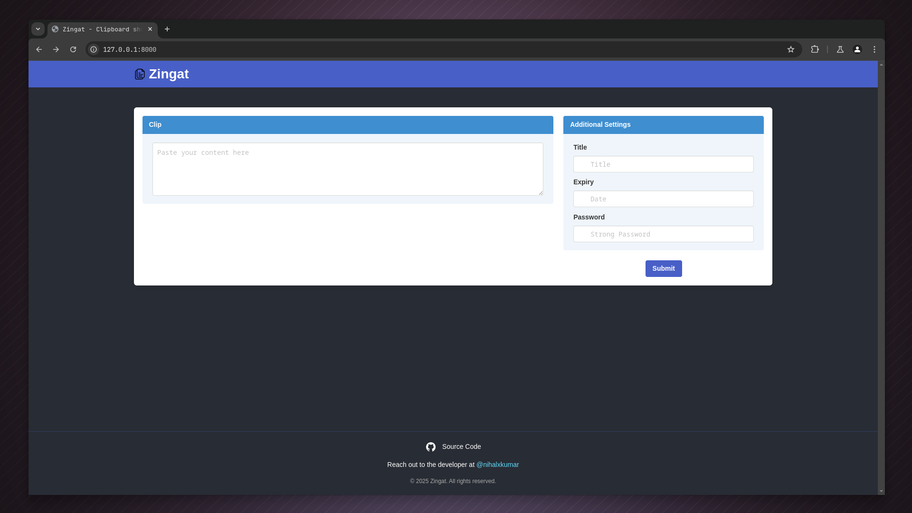

# Zingat

Pastebin like app in rust

Securely share texts on the internet with password protection and expiry date.

## Local Installation

- Install [Rust](https://www.rust-lang.org/tools/install)
- [Clone](https://docs.github.com/en/repositories/creating-and-managing-repositories/cloning-a-repository) the Repository
- Setup Database
  - Install SQLX with `cargo install sqlx-cli`
  - `sqlx database setup`
- For Web Interface
  - `cargo run --bin httpd`
- For Command Line Interface
  - `cargo run --bin clipclient`

## Tech Stack

- Rust
- SQLX
- Rocket
- Tokio

### Nuggets for devs

- Instead of logging each view (hit) directly into the database, we defer these operations into separate threads. This allows us to batch multiple hits into a single database commit, significantly improving performance and reducing contention on the database.
- 